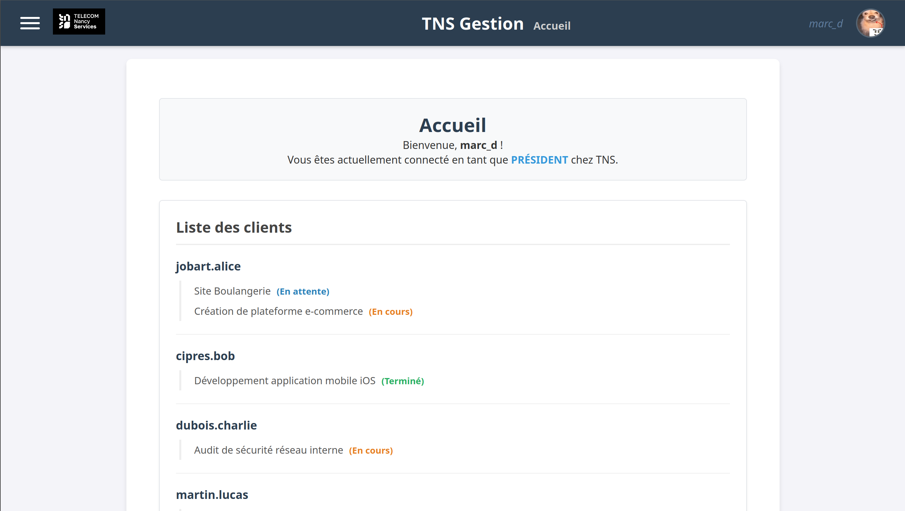
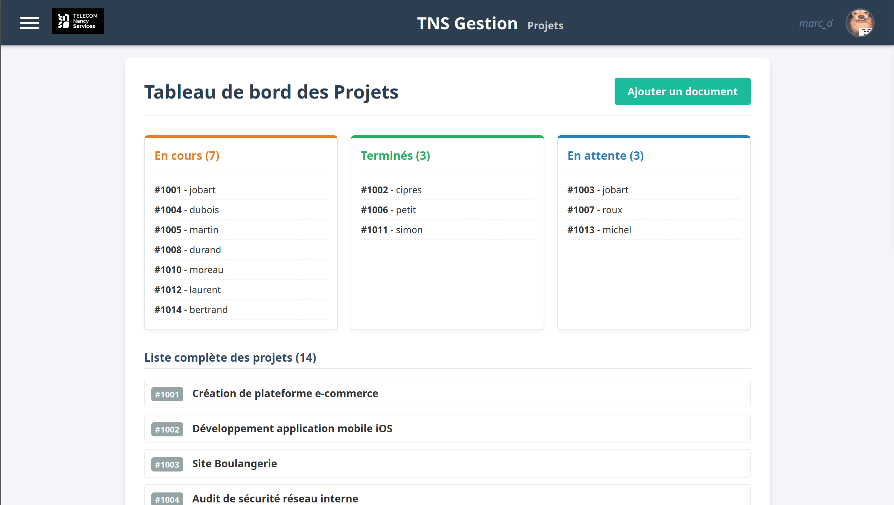
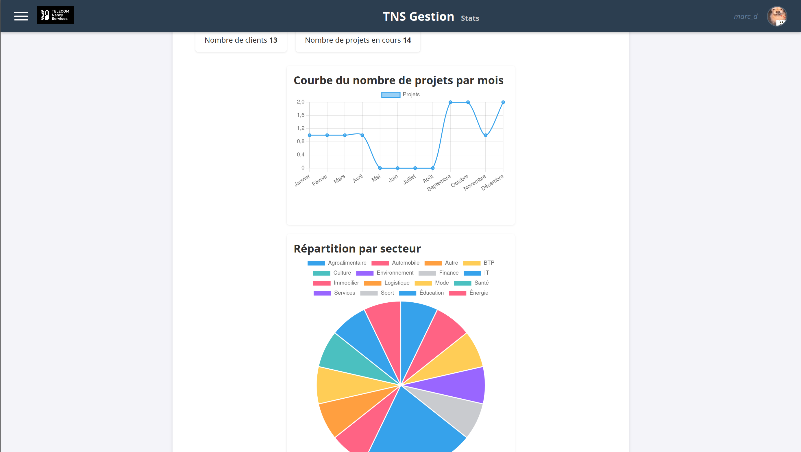
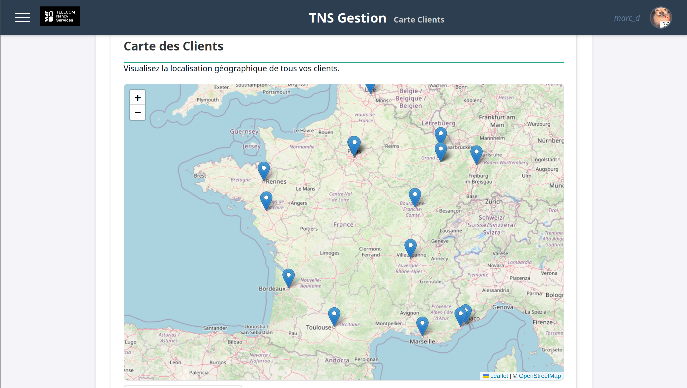
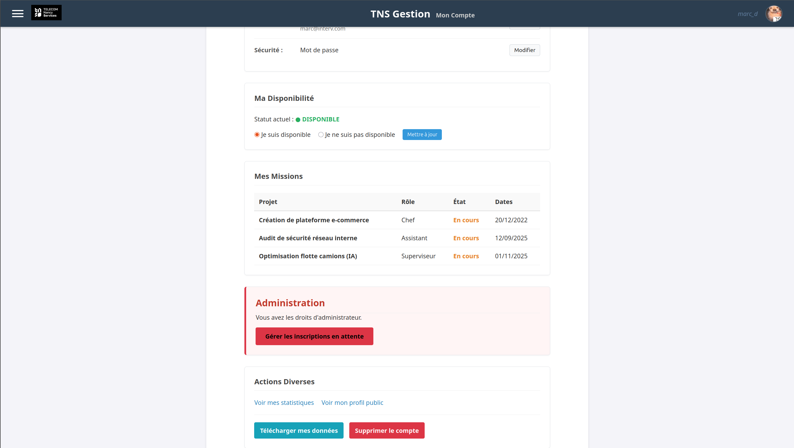

# Plateforme de gestion de projets TNS

Application web Flask pour piloter des clients, des projets et des intervenants dans un contexte de gestion interne (réseau TNS).

## Fonctionnalités

- Authentification utilisateur (connexion, déconnexion, rôles)
- Gestion des clients, intervenants et projets
- Détail projet avec documents et équipe
- Matching intervenants ↔ projets selon compétences/expérience
- Interface de prospection type Tinder-like
- Carte des clients (géolocalisation via Nominatim/OpenStreetMap)
- Statistiques et vues d’analyse
- Import / export de données (CSV/JSON selon les écrans)

## Aperçu de l'application

### Accueil



### Tableau de bord Projets



### Statistiques



### Carte des clients



### Espace compte / administration



## Stack technique

- Backend : Flask (Python 3.12), SQLite
- Frontend : Jinja2, HTML, CSS, JavaScript
- Géolocalisation : geopy + Nominatim
- Tests : pytest
- Conteneurisation : Docker + Docker Compose

## Arborescence utile

- `app.py` : application Flask principale
- `schema.sql` : schéma de base de données
- `data_inserts.sql` : données d’exemple
- `test_bdd.py` : initialise / reconstruit la base SQLite
- `tests/` : tests automatisés
- `templates/` : pages HTML (Jinja2)
- `static/` : CSS, JS, images, documents

## Prérequis

- Python 3.12+
- `pip`
- (Optionnel) Docker + Docker Compose

## Installation locale

```bash
git clone <url-du-repo>
cd Projet-TNS
python3 -m venv .venv
source .venv/bin/activate
pip install -r requirements.txt
```

## Initialiser la base de données

```bash
python test_bdd.py
```

Cela crée (ou recrée) le fichier SQLite `gestion_projets_test.db` à la racine du projet.

## Lancer l’application

### Option 1 — Python

```bash
python app.py
```

### Option 2 — Flask CLI

```bash
export FLASK_APP=app.py
flask run --host=0.0.0.0 --port=5000
```

Application disponible sur : http://localhost:5000

## Lancer avec Docker

```bash
docker compose up --build
```

Application disponible sur : http://localhost:5000

## Tests

```bash
pytest tests/
```

Notes :
- Les tests créent un utilisateur admin de test (`admin_test` / `password123`) dans une copie temporaire de la base.
- Les tests n’écrasent pas la base de travail de manière durable.

## Base de données

Le projet repose sur SQLite (`gestion_projets_test.db`) avec un schéma relationnel défini dans `schema.sql` (clients, intervenants, projets, participations, compétences, utilisateurs, documents, historique, etc.).

## Sécurité et limites

- Les mots de passe sont hachés (Werkzeug).
- Le projet utilise une clé Flask codée en dur dans `app.py` (à externaliser en variable d’environnement pour un usage production).
- Nominatim impose des règles d’usage et peut limiter les requêtes selon la charge.

## Équipe

Projet académique Telecom Nancy (2026).
